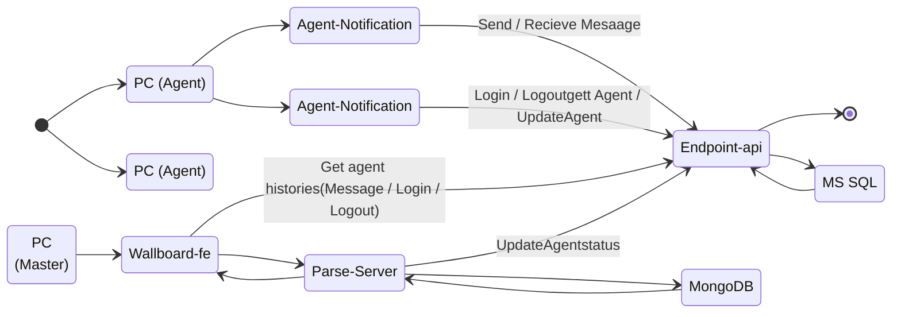

# engce301 - LAB6 Solution

This our Solution for LAB6 in ENGCE301 Class

##  Overview

     
    
     

##  **API Specification**

Link to API Specification Documentation: [This Link](./docs/api/README.md).

## Task
### Submission LAB6
Our Progress LAb6 Solution [Submission Task](https://lab-wb.cpe-rmutl.net/team06)
## Test Case Overview

Coming Soon!!

## Data Flow Diagrams

     
    
     

## **Activity Flow Diagram**

## Our Team
- นายศิริฤกษ์  อินตาคำ 65543206036-7
- นายสหชา   อินทร์ไชย 65543206037-5
- นางสาวพานพลอย  รักปัญญา 65543206073-0
- นายศุภฤกษ์  ขันทอง 65543206130-8
